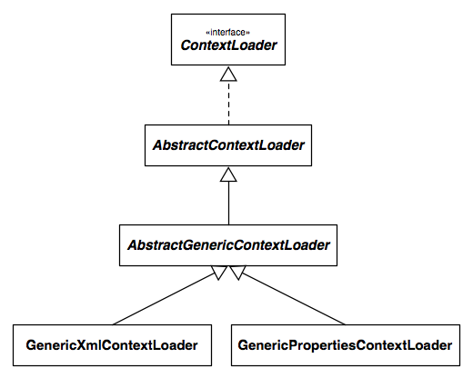

!SLIDE subsection transition=scrollDown
# New in Spring 3.1

!SLIDE bullets center
* Support for ...

!SLIDE bullets center
* testing with `@Configuration` classes

!SLIDE bullets center
* and

!SLIDE bullets center
* testing with _environment profiles_

!SLIDE bullets center
* made possible by ...

!SLIDE bullets center
* `SmartContextLoader`

!SLIDE bullets center
* `AnnotationConfigContextLoader`

!SLIDE bullets center
* `DelegatingSmartContextLoader`

!SLIDE bullets center
* updated context cache key generation

!SLIDE incremental
# `SmartContextLoader` SPI

* Supersedes `ContextLoader`
* Strategy for loading application contexts
* From `@Configuration` classes _or_ resource locations
* Supports environment profiles

!SLIDE incremental
# Implementations

* `GenericXmlContextLoader`
* `GenericPropertiesContextLoader`
* `AnnotationConfigContextLoader`
* `DelegatingSmartContextLoader`

!SLIDE center small transition=fade
# `ContextLoader` 2.5

!SLIDE center small transition=fade
# `ContextLoader` 3.1

!SLIDE subsection
# Testing with  @Configuration Classes

!SLIDE
# `@ContextConfiguration`

accepts a new `classes` attribute...

!SLIDE
	@@@ java

	@ContextConfiguration(
		classes={DataAccessConfig.class,
				 ServiceConfig.class})

!SLIDE bullets center

* First, a review with XML config for comparison...

!SLIDE code small
# `OrderServiceTest-context.xml`

	@@@ xml
	<?xml version="1.0" encoding="UTF-8"?>
	<beans ...>

	  <!-- will be injected into OrderServiceTest -->
	  <bean id="orderService"
	      class="com.example.OrderServiceImpl">
	    <!-- set properties, etc. -->
	  </bean>

	  <!-- other beans -->

	</beans>

!SLIDE code small
# `OrderServiceTest.java`

	@@@ java
	package com.example;

	@RunWith(SpringJUnit4ClassRunner.class)
	@ContextConfiguration
	public class OrderServiceTest {

	    @Autowired
	    private OrderService orderService;

	    @Test
	    public void testOrderService() {
	        // test the orderService
	    }
	}

!SLIDE bullets center

* Let's rework that example to use a `@Configuration` class and the new `AnnotationConfigContextLoader`...

!SLIDE code smaller
# `OrderServiceTest.java`

	@@@ java
	@RunWith(SpringJUnit4ClassRunner.class)

	public class OrderServiceTest {

	  @Autowired
	  private OrderService orderService;
	  // @Test methods ...
	}

!SLIDE code smaller
# `OrderServiceTest.java`

	@@@ java
	@RunWith(SpringJUnit4ClassRunner.class)
	@ContextConfiguration(
		loader=AnnotationConfigContextLoader.class)
	public class OrderServiceTest {

	  @Autowired
	  private OrderService orderService;
	  // @Test methods ...
	}

!SLIDE code smaller
# `OrderServiceTest.java`

	@@@ java
	@RunWith(SpringJUnit4ClassRunner.class)
	@ContextConfiguration
	public class OrderServiceTest {

	  @Autowired
	  private OrderService orderService;
	  // @Test methods ...
	}

!SLIDE code smaller
# `OrderServiceTest.java`

	@@@ java
	@RunWith(SpringJUnit4ClassRunner.class)
	@ContextConfiguration
	public class OrderServiceTest {

	  @Configuration
	  static class Config {

	  }

	  @Autowired
	  private OrderService orderService;
	  // @Test methods ...
	}

!SLIDE code smaller
# `OrderServiceTest.java`

	@@@ java
	@RunWith(SpringJUnit4ClassRunner.class)
	@ContextConfiguration
	public class OrderServiceTest {

	  @Configuration
	  static class Config {

	    @Bean // will be injected into OrderServiceTest
	    public OrderService orderService() {
	      OrderService orderService = new OrderServiceImpl();
	      // set properties, etc.
	      return orderService;
	    }
	  }

	  @Autowired
	  private OrderService orderService;
	  // @Test methods ...
	}

!SLIDE incremental
# What's changed?

* No XML
* Bean definitions are converted to Java
  * using `@Configuration` and `@Bean`
* Otherwise, the test remains unchanged

!SLIDE bullets center

* But what if we don't want a static inner `@Configuration` class?

!SLIDE bullets center

* Just externalize the config...

!SLIDE code smaller
# `OrderServiceConfig.java`

	@@@ java
	@Configuration
	public class OrderServiceConfig {

	  @Bean // will be injected into OrderServiceTest
	  public OrderService orderService() {
	    OrderService orderService = new OrderServiceImpl();
	    // set properties, etc.
	    return orderService;
	  }
	}

!SLIDE bullets center

* And reference the config classes in `@ContextConfiguration`...

!SLIDE code smaller
# `OrderServiceConfig.java`

	@@@ java
	@RunWith(SpringJUnit4ClassRunner.class)
	@ContextConfiguration(classes=OrderServiceConfig.class)
	public class OrderServiceTest {

	  @Autowired
	  private OrderService orderService;

	  @Test
	  public void testOrderService() {
	    // test the orderService
	  }
	}

!SLIDE incremental
# @Configuration + XML

* __Q__: How can we combine `@Configuration` classes with XML config?
* __A__: Choose one as the _entry point_.
* _That's how it works in production anyway_

!SLIDE incremental
# Importing Configuration

* In XML:
  * include `@Configuration` classes via component scanning
  * or define them as normal Spring beans
* In an `@Configuration` class:
  * use `@ImportResource` to import XML config files

!SLIDE subsection
# Testing with  Environment Profiles

!SLIDE incremental
# @ActiveProfiles

* ...

!SLIDE subsection
# Context Caching

!SLIDE bullets center
* ...

