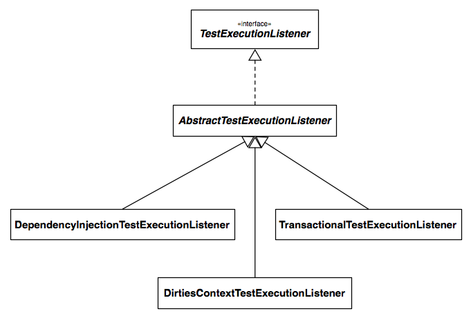
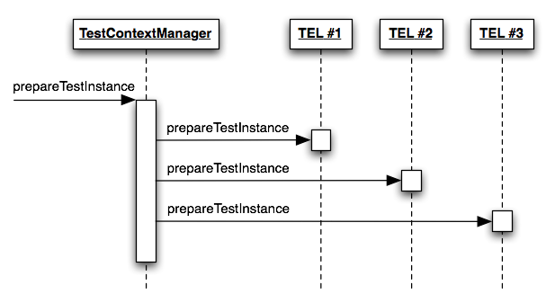
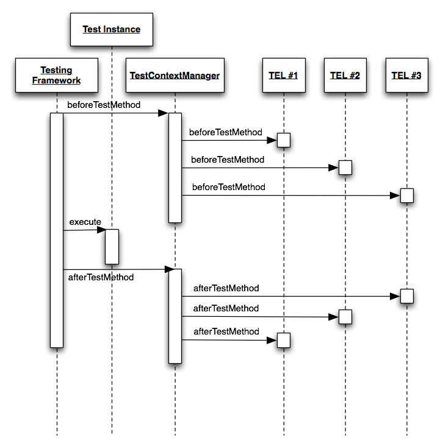
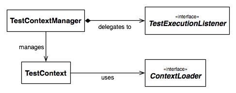

!SLIDE subsection
# Spring TestContext Framework

!SLIDE bullets center
* Introduced in Spring 2.5

!SLIDE bullets center
* Revised in Spring 3.1

!SLIDE bullets center
* Unit _and_ integration testing

!SLIDE bullets center
* Annotation-driven

!SLIDE bullets center
* Convention over Configuration

!SLIDE bullets center
* JUnit & TestNG

!SLIDE incremental small
# Spring & Unit Testing

* POJO-based programming model
* Program to interfaces
* IoC / Dependency Injection
* Out-of-container testability
* Testing mocks/stubs for various APIs: Servlet,  Portlet, JNDI
* General purpose testing utilities
  * `ReflectionTestUtils`
  * `ModelAndViewAssert`

!SLIDE incremental small
# Spring & Integration Testing

* `ApplicationContext` management & caching
* Dependency injection of test instances
* Transactional test management
  * with default rollback semantics
* `SimpleJdbcTestUtils`
* JUnit 3.8 support classes are deprecated as of Spring 3.0/3.1

!SLIDE incremental smaller
# Spring Test Annotations

* Application Contexts
  * `@ContextConfiguration`, `@DirtiesContext`
* `@TestExecutionListeners`
* Dependency Injection
  * `@Autowired`, `@Qualifier`, `@Inject`, …
* Transactions
  * `@Transactional`, `@TransactionConfiguration`, `@Rollback`, `@BeforeTransaction`, `@AfterTransaction`

!SLIDE incremental
# Spring JUnit Annotations

* Testing Profiles
  * _groups, not bean definition profiles_
  * `@IfProfileValue`, `@ProfileValueSourceConfiguration`
* JUnit extensions
  * `@ExpectedException`, `@Timed`, `@Repeat`

!SLIDE incremental
# Using the TestContext Framework

* Use the `SpringJUnit4ClassRunner` for __JUnit__ 4.5+
* Instrument test class with `TestContextManager` for __TestNG__
* Extend one of the base classes
  * `Abstract(Transactional)[JUnit4|TestNG]SpringContextTests`

!SLIDE small transition=fade
# Example: @POJO Test Class
	@@@ java

	public class OrderServiceTests {

	  @Test
	  public void testOrderService() { … }
	}

!SLIDE small
# Example: @POJO Test Class
	@@@ java
	@RunWith(SpringJUnit4ClassRunner.class)

	public class OrderServiceTests {

	  @Test
	  public void testOrderService() { … }
	}

!SLIDE small
# Example: @POJO Test Class
	@@@ java
	@RunWith(SpringJUnit4ClassRunner.class)
	@ContextConfiguration

	public class OrderServiceTests {

	  @Test
	  public void testOrderService() { … }
	}

!SLIDE small
# Example: @POJO Test Class
	@@@ java
	@RunWith(SpringJUnit4ClassRunner.class)
	@ContextConfiguration // defaults to
	// OrderServiceTests-context.xml in same package

	public class OrderServiceTests {

	  @Test
	  public void testOrderService() { … }
	}

!SLIDE small
# Example: @POJO Test Class
	@@@ java
	@RunWith(SpringJUnit4ClassRunner.class)
	@ContextConfiguration // defaults to
	// OrderServiceTests-context.xml in same package

	public class OrderServiceTests {

	  @Autowired
	  private OrderService orderService;

	  @Test
	  public void testOrderService() { … }
	}

!SLIDE small
# Example: @POJO Test Class
	@@@ java
	@RunWith(SpringJUnit4ClassRunner.class)
	@ContextConfiguration // defaults to
	// OrderServiceTests-context.xml in same package
	@Transactional
	public class OrderServiceTests {

	  @Autowired
	  private OrderService orderService;

	  @Test
	  public void testOrderService() { … }
	}

!SLIDE small
# Example: @POJO Test Class
	@@@ java
	@RunWith(SpringJUnit4ClassRunner.class)
	@ContextConfiguration // defaults to
	// OrderServiceTests-context.xml in same package
	@Transactional
	public class OrderServiceTests {

	  @Autowired
	  private OrderService orderService;

	  @BeforeTransaction
	  public void verifyInitialDatabaseState() { … }

	  @Test
	  public void testOrderService() { … }
	}

!SLIDE small
# Example: @POJO Test Class
	@@@ java
	@RunWith(SpringJUnit4ClassRunner.class)
	@ContextConfiguration // defaults to
	// OrderServiceTests-context.xml in same package
	@Transactional
	public class OrderServiceTests {

	  @Autowired
	  private OrderService orderService;

	  @BeforeTransaction
	  public void verifyInitialDatabaseState() { … }

	  @Before
	  public void setUpTestDataWithinTransaction() { … }

	  @Test
	  public void testOrderService() { … }
	}

!SLIDE subsection small
# Core Components

!SLIDE incremental
# `TestContext`

* Tracks context for current test
* Delegates to a `ContextLoader`
* Caches `ApplicationContext`

!SLIDE incremental
# `TestContextManager`

* Manages the `TestContext`
* Signals events to listeners:
  * before: _before-class methods_
  * after: _test instantiation_
  * before: _before methods_
  * after: _after methods_
  * after: _after-class methods_

!SLIDE incremental small
# `TestExecutionListener` SPI

* Reacts to test execution events
  * Receives reference to current `TestContext`
* Out of the box:
  * `DependencyInjectionTestExecutionListener`
  * `DirtiesContextTestExecutionListener`
  * `TransactionalTestExecutionListener`

!SLIDE center small transition=fade
# `TestExecutionListener`

!SLIDE center small transition=scrollUp
# TEL: _Prepare Instance_

!SLIDE center small transition=scrollLeft
# TEL: _Befores and Afters_

!SLIDE incremental small
# `ContextLoader` SPI

* Strategy for loading application contexts
  * from resource locations
* Out of the box:
  * `GenericXmlContextLoader`
  * `GenericPropertiesContextLoader`

!SLIDE center small
# `ContextLoader` 2.5

!SLIDE center small transition=scrollUp
# Putting it all together

